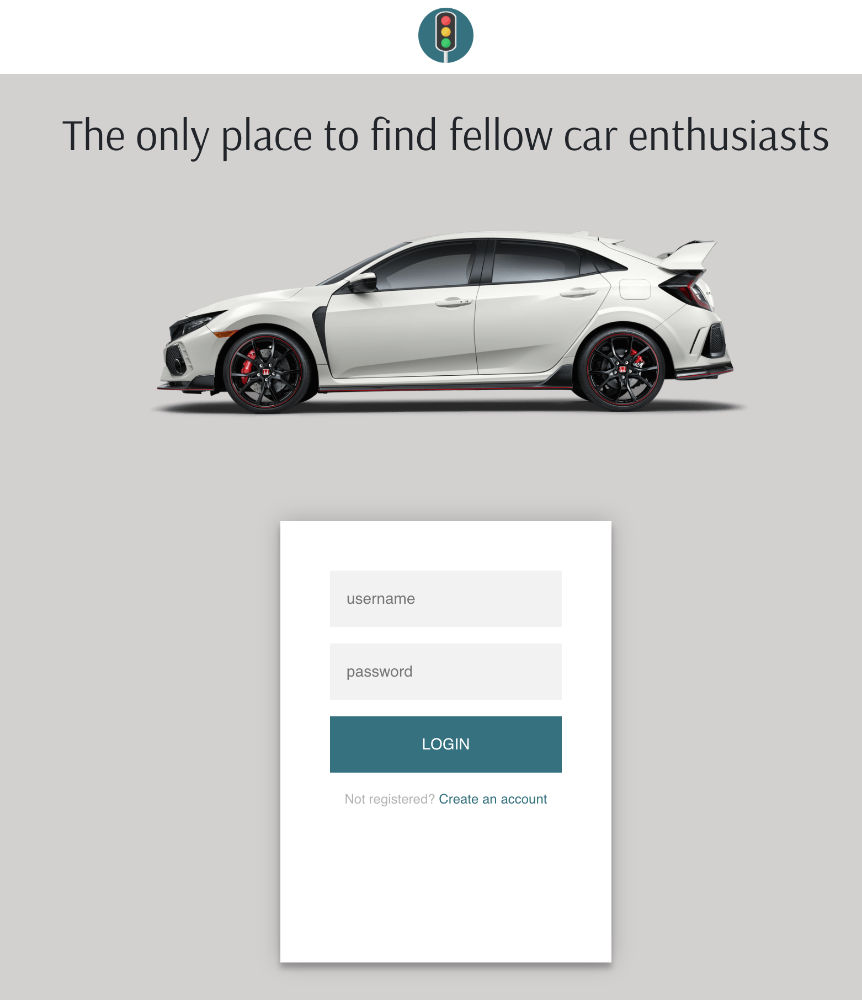
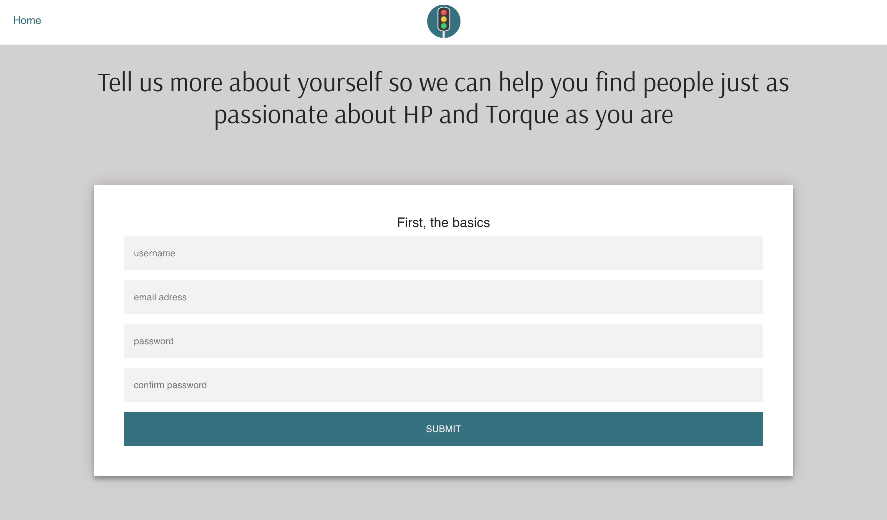
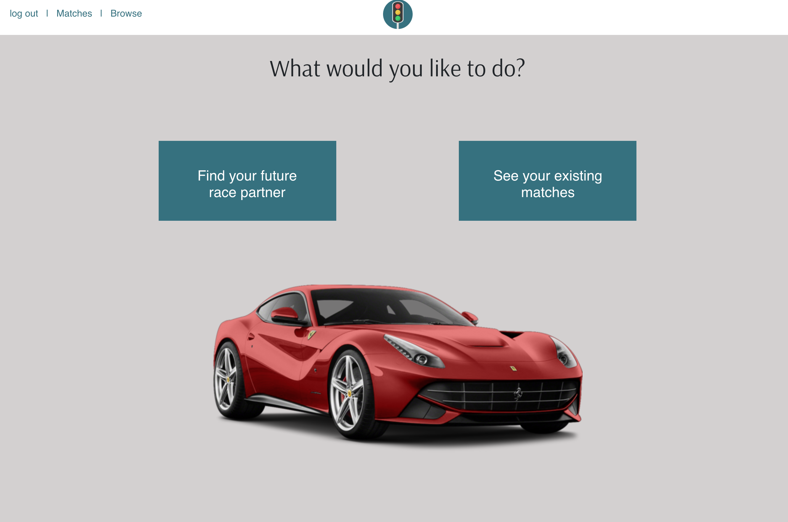
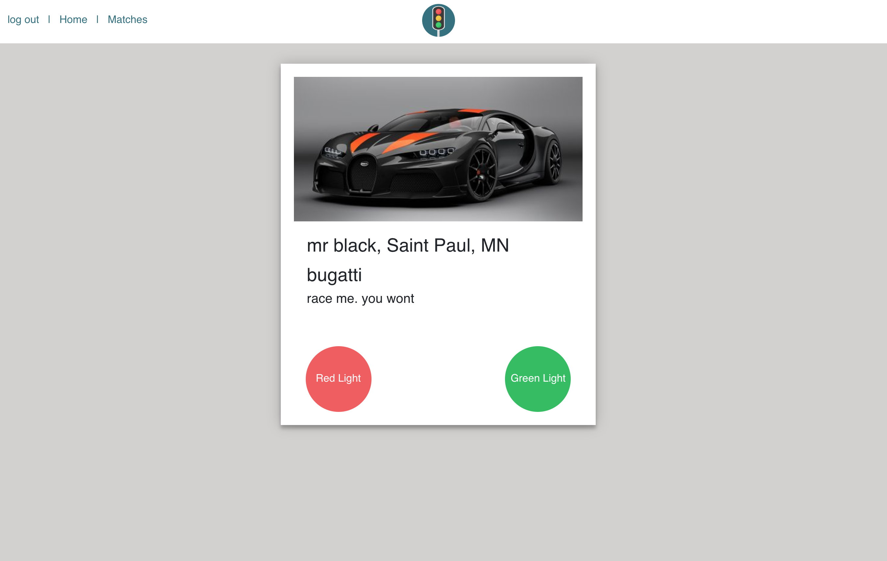

# Red Light Green Light

#### Tech Lead

Jackson Oppenheim

#### Back End

Brian Samuels
Nick Wilson

#### Front End

Jon Alden
Ben Escoria

https://jl-testing.herokuapp.com/

---

### What is Red Light Green Light?

Red Light Green Light is a social media networking app that brings together car enthusiasts. You can create an account with a username,email, and password that is hashed and stored securely and then enter some bio information. On the browse page, you can see other users and either "Green Light" them or "Red Light" them. If you and another user Green Light each other, you'll be able to see their account on your matches page.

### NPM Dependencies

- axios 0.19.0
- bcrypt-nodejs 0.0.3
- dotenv 8.1.0
- express 4.17.1
- express-handlebars 3.1.0
- express-session 1.16.2
- moment 2.24.0
- mysql 2.17.1
- mysql2 1.7.0
- passport 0.4.0
- passport-local 1.0.0
- sequelize 5.19.1
- session 0.1.0

### Security

Account creation and secure logging in is handled using Passport to hash passwords.

### Database

The database is a mySQL database running on JawsDB that is accessed through an restful API using sequelize as an ORM.

As new users create accounts, an entry is added to the Users table.

When browsing through other users, if the current user is voting on another user for the first time, a new entry is added to the Matches table which keeps track of the current user, the other user, whether the current user voted "yes" or "no", and whether it is a match.

When looking at your matches, the server grabs the user info on all completed matches for the current user, and sends them to the front end to display.

### Server

The server is an express server running in node.

### Rendering

Rendering is handled through a combination of express-handlebars and vanilla client-side Javascript.

### Photos

#### Login Page



#### New User



#### Dashboard



#### Browse



#### Matches


### Organization

```
project
│   README.md
│   package.json
|   LICENSE - this is our MIT license
│   server.js - this our express server
│
└───config
    |   config.json - this contains our configuration for connecting to our sql database
    |   passport.js - this contains our local strategies for encrypting and decrypting user passwords

└───models
    |   index.js - allows the server to interact with the tables in our database
    |   Matches.js - this is the sequelize schema for all matches
    |   user.js - this is the sequelize schema for all users
    |   schema.sql - this is the initial schema for mySql
    |   seeds.sql - this is a seeding file for users

└───public
    └───img - this folder contains logos and such

    └───js
        |   browse.js - this contains the front end logic for rendering the browse page and sending axios requests when the current user votes
        |   matches.js - this contains the front end axios request to get all matches for the current user, as well as rendering info
        |   questionaire.js - this contains the axios request for updating user proflies
        |   signin.js - this contains the axios request to log in with passport
        |   signup.js - this contains the axios request to post a new user to the database through passport
        |   test.js - this is an open-ended file for testing various front end scripts. It is only ever used in the development stage
    └───styles
        |   style.css - this contains our styling

└───routes
    │   apiRoutes.js - this contains all of the routing information for API requests, as well as server-side logic for sending the
                       the proper information as well as preventing unauthorized users from directly accessing the database
    │   htmlRoutes.js - this contains all of the routing information for HTML requests, sending requests to the passport local
                        strategies, as well as preventing unauthorized users from accessing pages that require login

└───views
    │   404.handlebars - this contains the 404 not found page
    │   browse.handlebars - this contains the page browse other profiles
    │   dashboard.handlebars - this contains the home page for logged in users
    │   index.handlebars - this contains the log in page
    │   matches.handlebars - this contains the page for viewing your matches
    │   questionaire.handlebars - this contains the page for creating a new user
    │   questionaire2.handlebars - this contains the page for adding user proflie information
    │   questionaire2.handlebars - this contains the page for adding user proflie information

    └───layouts
        |   main.handlebars - this is the main handlebars layout page


```

#### License

This application is under the MIT licence.
